# Sharing Windoze Internet with Zero

This utilizes a lot of the information frojm circuitbasics.com.

## Install the RNDIS Drivers

With your Pi Zero still connect to your computer, navigate to the Windows Device Manager. Under “Other devices” find “RNDIS/Ethernet Gadget”, and right click on it. Then click “Update driver software” from the menu:

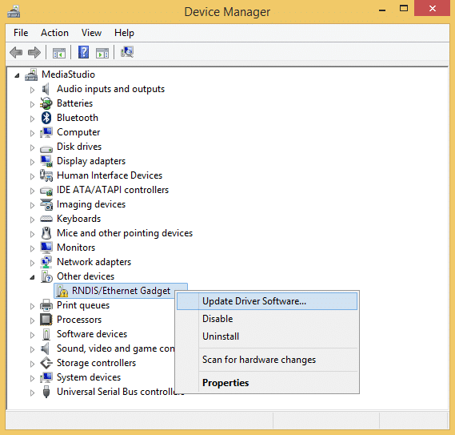

In the next window, select “Browse my computer for driver software”:

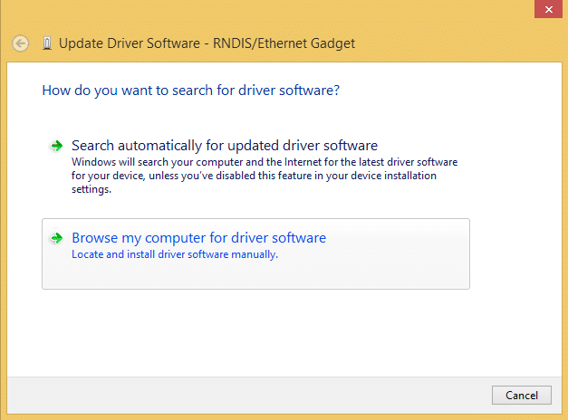

Now click “Let me pick from a list of device drivers on my computer”:

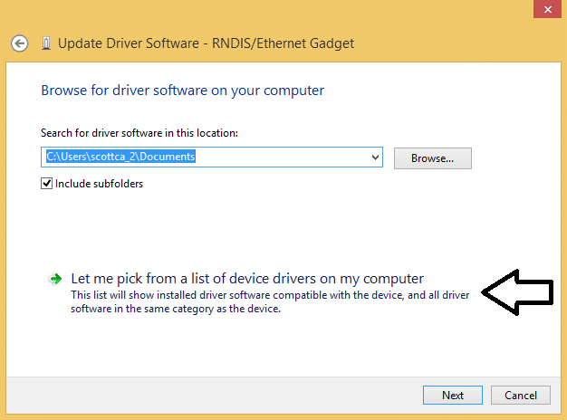

Scroll down the list and select “Network adapters”, then click Next:

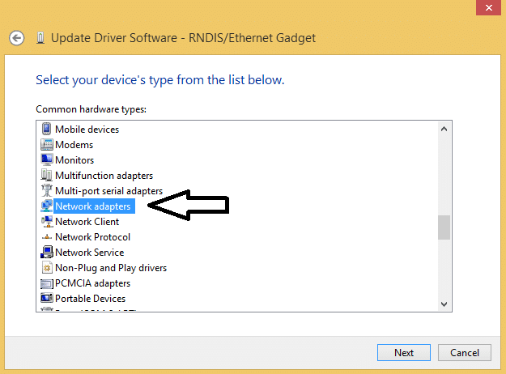

Now scroll down the “Manufacturers” list in the window on the left, and select “Microsoft”. Then scroll down the “Network Adapters” list on the right side window until you find a line that says “Remote NDIS Compatible Device”. Select that, then click Next:

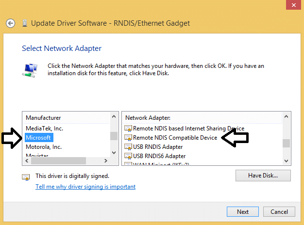

A warning will pop up about Windows not being able to verify the driver, but just click “Yes” to get past it:

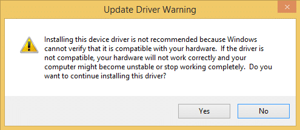

After the driver is finished installing, you should see something like this:

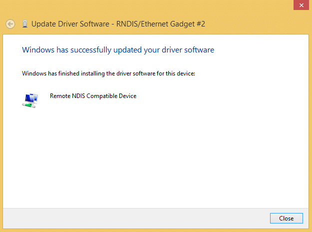

Now try to log into your Pi with PuTTY using the address raspberrypi.local. You should be able to get in:

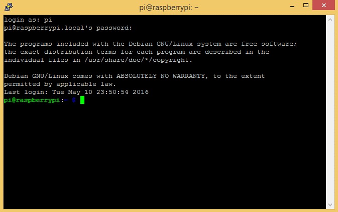

At this point, you should run sudo raspi-config to expand the file system. When that’s done, reboot the Pi with sudo reboot.

After the reboot, if you log back in with PuTTY you can check to see if it has internet access by entering sudo ping www.google.com at the command prompt. You will probably get an error that says “ping: unknown host www.google.com” or something similar. In the next section, I’ll show you how to give the Pi access to your computer’s internet connection.

## Sharing Internet Access

To share your computer’s internet connection with the Pi, we need to allow network sharing on one of your computer’s network connections.

With your Pi Zero plugged in and powered on, navigate to the “Network Connections” window:

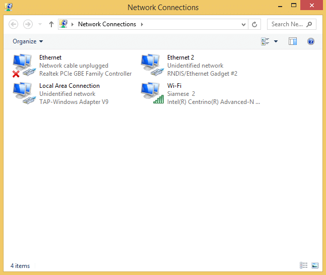

Your Pi will show up as a separate network connection. It will say “RNDIS/Ethernet Gadget” under the connection name. In my case, it’s “Ethernet 2”.

Now you should decide which connection you want your Pi to access the Internet over (i.e. WiFi or Ethernet). I want my Pi to access the internet over my computer’s WiFi connection, so I’ll need to enable my WiFi connection to allow sharing. Right click on the connection you want to use, then select “Properties”:

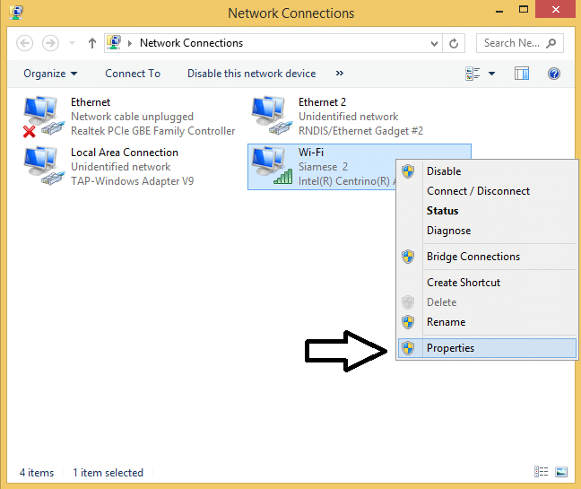

In the WiFi Properties window, click on the “Sharing” tab:

Click the box that says “Allow other network users to connect through this computer’s Internet connection”, then click the drop down menu below that. Find the network connection given to your Pi (Ethernet 2 in my case), select it, then click OK:

Raspberry Pi Zero Ethernet Gadget - Allow other network users to connect

The network you chose to share access with your Pi will show the name of your WiFi network, followed by “Shared” in the “Network Connections” window :

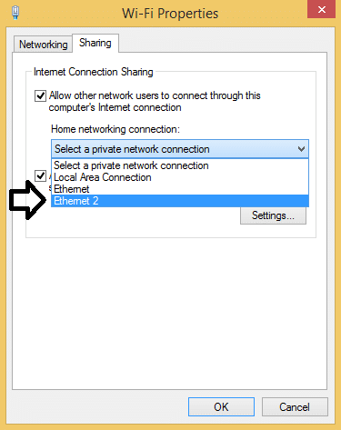

Now reboot your Pi and log back into it with PuTTY.

Enter ifconfig at the command prompt, and you should see a usb0 connection showing TX and RX packets being sent and received:

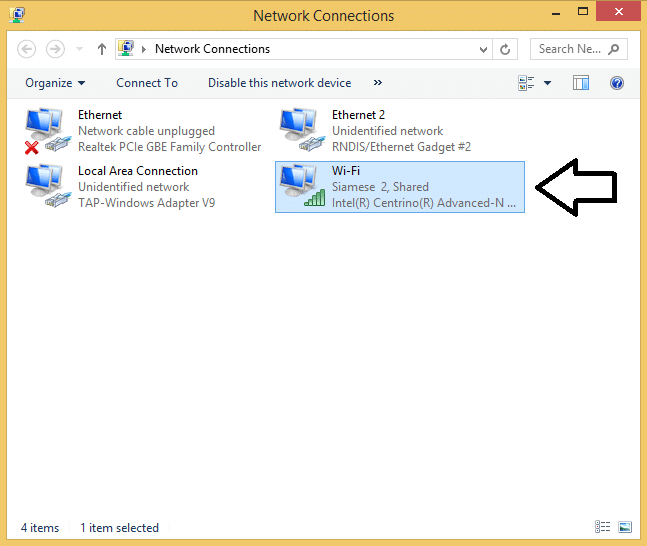

Enter sudo ping www.google.com to test the connection further, and you should see that your Pi has internet access!

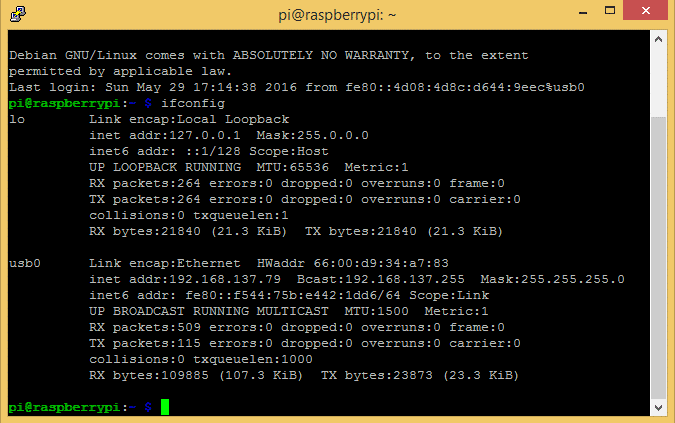

# References

- [circuitbasics.com](http://www.circuitbasics.com/raspberry-pi-zero-ethernet-gadget/)
